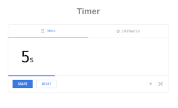

# 🪧 Timer

## 📋 About

2023-02-21 homework.

Design: google timer. Only for learning purposes.

🌐 **Site published at**: [https://codevivi.github.io/timer](https://codevivi.github.io/timer)

🎯 **Goals:**

- JavaScript **timer** or stopwatch functionality

🚀 **Features:**

- Reset
- Pause
- Change time
- Sound option
- Progress bar
